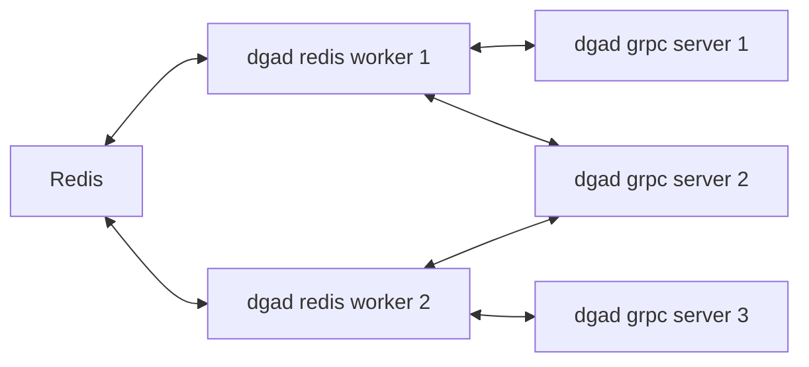

# DGA Detective Asynchronous Redis Pipeline

## Deployment, configuration and updating

```bash
# copy the default configuration and make the necessary changes
cp config-defaults.env config.env
# deploy
docker-compose up -d
# update
docker-compose down
git pull
docker-compose up -d
# scale services up/down
docker-compose up -d scale redis_worker=4 grpc_detective=4
```
This deploys:
* 1 or more Dga Detective redis workers
* 1 or more Dga Detective grpc servers
* classification requests from the redis workers will be automatically load balanced to the available grpc servers

## Pipeline Flow



1. a domain is added to a redis set (redis is not deployed by this deployment!)
2. a redis worker "listens" to the redis set and eventually pulls the domain from it (the domain is removed from the set)
3. the redis worker sends a grpc request to classify the domain to a dga detective grcp server
4. a grpc server then classifies the domain and returns the label back to the redis worker
5. the redis worker stores the domain with its label back to redis, using its `key:value` store

Please notice:
* This is a convenience asynchronous pipeline to make the classification of large amounts of domains simple for the user. The user just needs to add its domains to redis, rather than interact directly with the dga detective api. Due to the asynchronous nature of this architecture, it can take several seconds for domains to be picked up by a worker. This is normal.
* For synchronous scenarios (or if you want to use something other than redis for storage) you can interact directly with the dga detective server through the gRPC api exposed. The redis workers do exactly this under the hood. Dga detective provides [example client code in python](https://gitlab.com/cossas/dgad/-/blob/v3.1.0/dgad/grpc/classifier_client.py) to interact with a deployed server.
* you can scale the redis workers and the grpc servers indipendently
